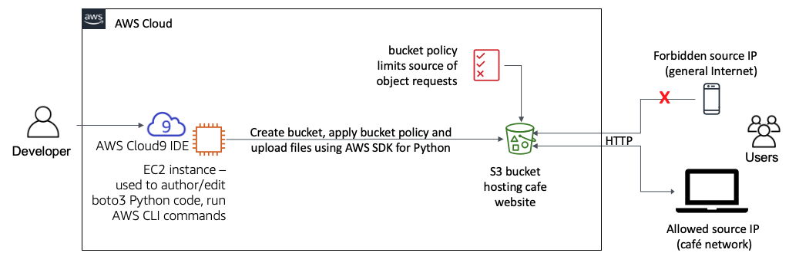

# Working with Amazon S3

In this project, I use Amazon Simple Storage Service (Amazon S3) to host a static website. I will also implement architectural best practices to protect and manage your data.

by the end of this project, I will have created an AWS Cloud9 instance and performed the actions that are shown below:

The full documentation you can find [here](static-site.ipynb).

